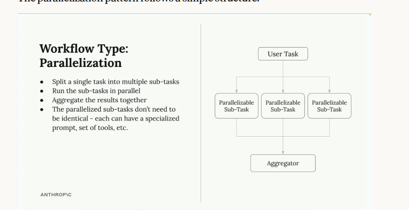
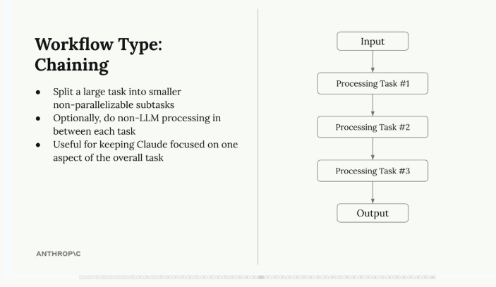
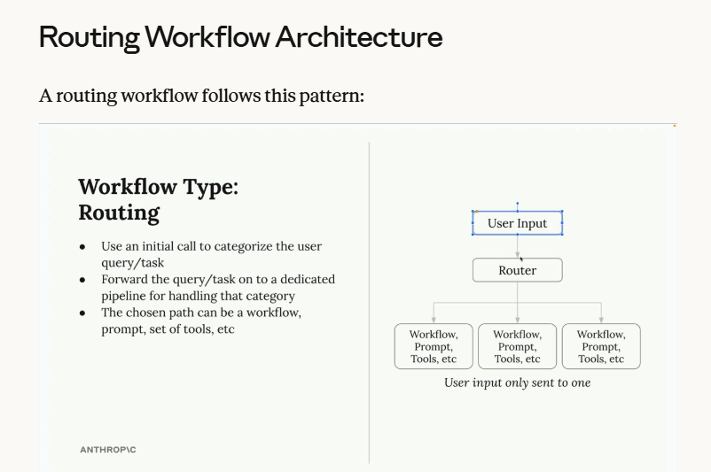
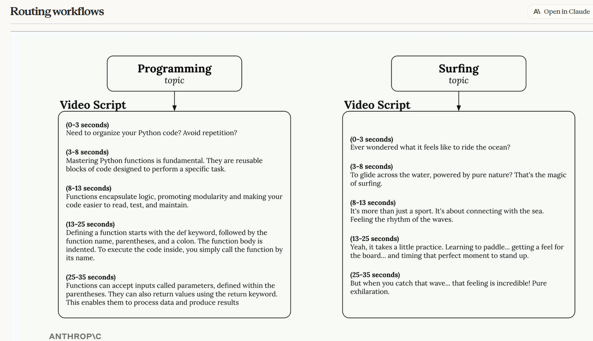
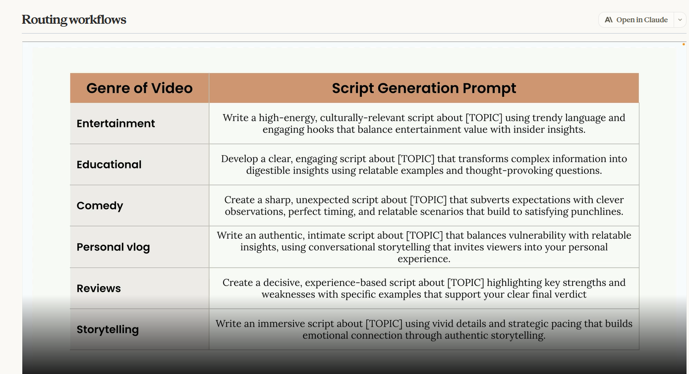
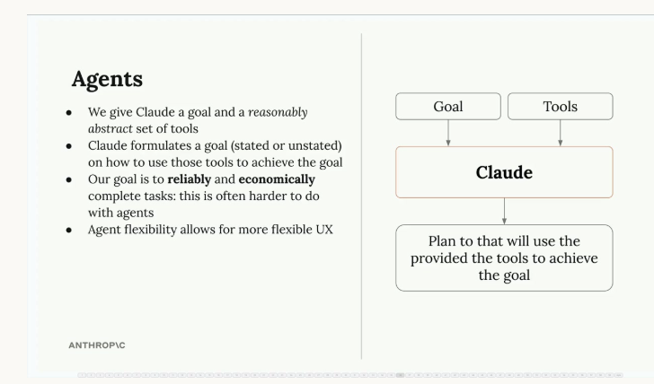
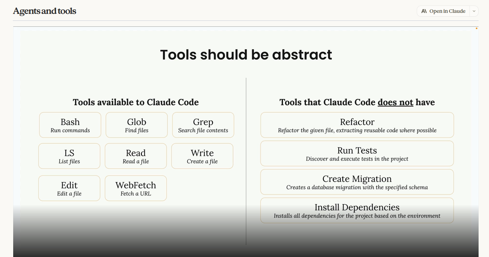

# Session 09: Agents and Workflows

## Lessons trong section này
- [x] Agents and workflows
- [x] Parallelization workflows
- [x] Chaining workflows
- [x] Routing workflows
- [x] Agents and tools
- [x] Environment inspection
- [x] Workflows vs agents
- [x] Agent SDK overview
- [ ] Quiz on Agents and Workflows

## Key Concepts

### 1. Agents vs Workflows — phân biệt cốt lõi
Cả 2 đều là chiến lược xử lý task mà Claude không thể xong trong 1 request duy nhất. Điểm
khác biệt nằm ở việc ta hiểu rõ task đến đâu:

- **Workflow** — 1 chuỗi lệnh gọi Claude được thiết kế sẵn (predetermined) để giải quyết 1
  vấn đề cụ thể qua các bước cố định. Dùng khi ta **hình dung được chính xác flow/step**
  Claude cần đi qua, hoặc khi UX của app giới hạn user vào 1 tập task cố định.
- **Agent** — cho Claude 1 goal + 1 bộ tool, để Claude **tự quyết định** cách hoàn thành goal
  đó qua nhiều bước. Dùng khi ta **không chắc trước** sẽ giao task/tham số gì cho Claude
  (task quá đa dạng, không thể liệt kê hết thành steps cố định).

→ Lưu ý: chỉ *nhận diện* được pattern (workflow/agent) không tự làm gì cả — vẫn phải viết
code thực sự để implement nó.

**So sánh chi tiết — Benefits/Downsides:**

| | Workflows | Agents |
|---|---|---|
| **Summary** | Chuỗi call Claude được thiết kế sẵn (predetermined) để giải quyết 1 problem/set of problems đã biết trước; dùng khi hình dung được flow các bước ngay từ đầu | Claude được cấp 1 bộ tool cơ bản, tự formulate plan để dùng tool đó hoàn thành task; không biết trước chính xác task/tham số nào sẽ được giao |
| **Benefits** | - Claude tập trung 1 subtask/lần → accuracy cao hơn<br>- Dễ evaluate/test hơn nhiều vì biết chính xác từng step<br>- Execution predictable, reliable hơn<br>- Hợp với problem cụ thể, well-defined | - UX linh hoạt hơn<br>- Task completion linh hoạt hơn nhiều — Claude tự kết hợp tool theo cách không lường trước để xử lý đa dạng task<br>- Xử lý được tình huống mới (novel) chưa lường trước lúc dev<br>- Có thể hỏi lại user khi cần thêm input |
| **Downsides** | - Kém linh hoạt — chỉ giải quyết đúng loại task đã thiết kế<br>- UX bị gò bó hơn — phải biết trước input chính xác cho flow<br>- Cần nhiều công sức lên kế hoạch/thiết kế trước | - Tỷ lệ hoàn thành task thành công thấp hơn workflow<br>- Khó instrument/test/evaluate hơn vì thường không biết trước agent sẽ chạy chuỗi step nào<br>- Behavior kém predictable hơn |

**Nguyên tắc chọn lựa (khuyến nghị chung):** mục tiêu chính của engineer là giải quyết
problem **đáng tin cậy** — user không quan tâm bạn build "agent xịn" hay không, họ chỉ cần
sản phẩm chạy ổn định. → **Luôn ưu tiên implement workflow khi có thể**, chỉ dùng agent khi
thực sự cần thiết (task quá đa dạng/không đoán trước được, cần Claude tự sáng tạo cách giải
quyết). Workflow phù hợp khi process đã well-defined; agent phù hợp khi cần xử lý request
không đoán trước, đòi hỏi creative problem-solving.

### 2. Ví dụ workflow thực tế — Image to CAD
Bài toán: user upload ảnh 1 metal part, app tự sinh ra file STEP (chuẩn công nghiệp cho 3D
model). Vì đã biết rõ từng bước cần làm khi có ảnh input → đây là ứng viên hoàn hảo cho
**workflow** (không cần agent tự quyết định gì cả):

1. Đưa ảnh vào Claude, yêu cầu mô tả object trong ảnh
2. Dựa trên mô tả, yêu cầu Claude dùng thư viện `CadQuery` để model lại object đó
3. Tạo bản rendering từ model vừa tạo
4. Yêu cầu Claude **chấm điểm** rendering so với ảnh gốc — nếu có vấn đề, quay lại sửa

### 3. Evaluator-Optimizer pattern
Workflow "Image to CAD" ở trên chính là 1 ví dụ điển hình của pattern **Evaluator-Optimizer**
— 1 recipe có thể tái sử dụng cho nhiều bài toán khác nhau:

- **Producer** — nhận input, tạo ra output (vd Claude dùng CadQuery để model + render)
- **Grader (Evaluator)** — chấm điểm output đó theo tiêu chí cho trước
- **Feedback loop** — nếu grader không chấp nhận, feedback được đưa ngược lại cho producer
  để cải thiện
- **Iteration** — lặp lại chu trình này cho tới khi grader chấp nhận output

→ Pattern này hữu ích bất cứ khi nào có 1 bước "tạo ra" và 1 bước "đánh giá" độc lập được với
nhau — vd sinh code rồi chạy test, viết bài rồi self-critique (xem `01_chaining_workflow.py`
— chaining là dạng đơn giản của evaluator-optimizer, chỉ chạy 1 vòng không lặp lại).

### 4. Parallelization workflows
**Vấn đề với single complex prompt:** khi task cần Claude đánh giá 1 input theo nhiều tiêu
chí khác nhau cùng lúc (vd chọn vật liệu phù hợp nhất cho 1 part trong 6 loại: metal,
polymer, ceramic, composite, elastomer, wood), nhồi hết tiêu chí của cả 6 loại vào 1 prompt
duy nhất khiến Claude phải cân nhắc quá nhiều consideration cùng lúc → kết quả kém tin cậy
hơn, dễ nhầm lẫn giữa các tiêu chí.

**Giải pháp — Parallelization:** thay vì 1 request khổng lồ, tách thành nhiều request chạy
song song, mỗi request chỉ tập trung đánh giá theo **1 tiêu chí chuyên biệt**:

1. **Split** — chia 1 task phức tạp thành nhiều sub-task độc lập, tập trung (vd 1 request/
   loại vật liệu, mỗi request có criteria riêng cho loại đó)
2. **Run song song** — gửi tất cả sub-task cùng lúc (cùng input, khác prompt/criteria) để
   xử lý nhanh hơn
3. **Aggregate** — thu kết quả từ tất cả sub-task, đưa lại cho Claude 1 lần nữa để so sánh
   và ra quyết định cuối cùng

Lưu ý: các sub-task **không cần giống hệt nhau** — mỗi cái có thể có prompt riêng, tool
riêng, hoặc tiêu chí đánh giá riêng.

**Lợi ích:**
- **Focused attention** — Claude tập trung vào đúng 1 khía cạnh mỗi lần, không phải cân bằng
  nhiều tiêu chí cạnh tranh nhau cùng lúc → phân tích sâu và chính xác hơn
- **Dễ optimize từng phần** — có thể cải thiện/test riêng prompt cho từng sub-task mà không
  ảnh hưởng các sub-task khác (vd sửa riêng prompt đánh giá metal mà không đụng tới polymer)
- **Dễ scale** — thêm 1 tiêu chí/loại đánh giá mới chỉ cần thêm 1 request song song, không
  phải viết lại các prompt đã có hay lo chúng xung đột với tiêu chí mới
- **Reliability cao hơn** — giảm cognitive load cho model nhờ chia nhỏ task → kết quả ổn
  định, nhất quán hơn

**Khi nào dùng:** phù hợp với quyết định phức tạp có thể tách thành nhiều đánh giá **độc
lập** — task cần Claude cân nhắc nhiều tiêu chí, so sánh nhiều lựa chọn, hoặc quyết định
đụng tới nhiều domain chuyên môn khác nhau. Điều kiện quan trọng: mỗi sub-task phải hoạt
động độc lập được và đóng góp 1 phần phân tích riêng biệt cho quyết định cuối.

**Sơ đồ kiến trúc** (slide gốc): `User Task` → chia thành nhiều `Parallelizable Sub-Task`
chạy song song → gộp lại ở 1 `Aggregator` duy nhất để ra kết quả cuối.


### 5. Chaining workflows
**Chaining workflow** chia 1 task lớn, phức tạp thành nhiều **subtask nhỏ, tuần tự**
(sequential) — mỗi subtask do 1 call Claude riêng đảm nhiệm, subtask sau dùng output của
subtask trước làm input. Xem code minh hoạ ở [`01_chaining_workflow.py`](exercises/01_chaining_workflow.py).

Ví dụ end-to-end — tool marketing tự động tạo + đăng video social media:
1. Tìm trending topic liên quan trên Twitter
2. Chọn topic hay nhất (dùng Claude)
3. Research topic đó (dùng Claude)
4. Viết script cho video short-form (dùng Claude)
5. Dùng AI avatar + text-to-speech để tạo video
6. Đăng video lên social media

→ Không phải mọi bước đều gọi Claude — có thể xen kẽ **non-LLM processing** (bước 5, 6)
giữa các bước gọi Claude.

**Vì sao chain thay vì gộp thành 1 prompt to?** 1 prompt to bắt Claude vừa research, vừa
viết script, vừa tự kiểm tra style → dễ "chia trí", làm không tốt bằng khi tập trung 1
việc. Chia nhỏ giúp mỗi call chỉ tập trung đúng 1 khía cạnh của task tổng.

**"Long prompt problem"** — càng nhồi nhiều constraint vào 1 prompt (vd: không được lộ là
AI viết, không dùng emoji, tránh văn phong sến/cliché, giữ giọng văn kỹ thuật chuyên
nghiệp), Claude càng dễ bỏ sót 1-2 constraint dù đã liệt kê rõ ràng.

**Giải pháp — chain 2 bước (generate → revise):**
- **Bước 1:** Gửi prompt gốc, chấp nhận kết quả đầu ra có thể chưa hoàn hảo
- **Bước 2:** Gửi tiếp 1 request revision riêng, đưa lại bài viết vừa sinh ra + hướng dẫn
  sửa cụ thể, có thứ tự rõ ràng, ví dụ:
  ```
  Revise the article provided below. Follow these steps to rewrite the article:
  1. Identify any location where the text identifies the author as an AI and remove them
  2. Find and remove all emojis
  3. Locate any cringey writing and replace it with text that would be written by a
     technical writer
  ```
  → Ở bước này Claude chỉ tập trung "sửa" thay vì vừa sáng tác vừa tuân thủ rule, nên bám
  constraint tốt hơn nhiều so với nhồi hết vào 1 prompt sinh nội dung.

**Khi nào dùng chaining:** task phức tạp có nhiều constraint cùng lúc; Claude hay "quên"
vài constraint khi prompt quá dài; cần xử lý/validate output giữa các bước (có thể bằng
code thường, không cần LLM); muốn mỗi lần gọi Claude chỉ tập trung 1 việc, dễ debug hơn.

**Sơ đồ kiến trúc** (slide gốc): `Input` → `Processing Task #1` → `Processing Task #2` →
`Processing Task #3` → `Output` — mỗi task là 1 bước xử lý tuần tự, không parallelizable
được (khác với Parallelization ở mục 4).


### 6. Routing workflows
**Routing workflow** giải quyết vấn đề: các loại request khác nhau cần cách xử lý khác
nhau — thay vì 1 prompt "one-size-fits-all", ta **phân loại** (categorize) request trước,
rồi **route** (định tuyến) nó tới pipeline xử lý chuyên biệt. Xem code minh hoạ ở
[`02_routing_workflow.py`](exercises/02_routing_workflow.py).

**Ví dụ vấn đề:** Tool tạo video script từ 1 topic user nhập. Topic "programming" cần nội
dung **educational** (giải thích rõ ràng, có định nghĩa); topic "surfing" hợp với nội dung
**entertainment** (hào hứng, giàu hình ảnh). 1 prompt chung không xử lý tốt cả 2.

**Bước 1 — Định nghĩa categories:** liệt kê trước các loại nội dung app có thể cần, mỗi
category có 1 prompt template riêng tối ưu cho đúng văn phong category đó. Vd:
**Entertainment**, **Educational**, **Comedy**, **Personal vlog**, **Reviews**,
**Storytelling** — mỗi loại có tông giọng/tiêu chí riêng.

**Bước 2 — Routing gồm 2 lần gọi Claude:**
1. **Categorization** — gửi topic cho Claude, yêu cầu phân loại vào đúng 1 category:
   ```
   Categorize the topic of a video into one of the listed categories:
   <topic>Python functions</topic>

   <categories>
   - Educational
   - Entertainment
   - Comedy
   - Personal vlog
   - Reviews
   - Storytelling
   </categories>
   ```
   → Claude trả về vd `"Educational"`
2. **Specialized processing** — dùng category kết quả để chọn đúng prompt template
   chuyên biệt, rồi gọi Claude lần nữa để sinh nội dung thật.

**Kiến trúc:** `User input → Router (Claude call phân loại) → chọn 1 trong N pipeline
chuyên biệt → chỉ pipeline đó xử lý tiếp`. Điểm mấu chốt: input chỉ đi vào **đúng 1**
pipeline, không chạy qua tất cả — nhờ vậy mỗi pipeline được tối ưu sâu cho đúng use case.

**Khi nào dùng routing:** app xử lý nhiều loại request khác nhau, mỗi loại cần cách tiếp
cận riêng; có thể định nghĩa rõ ràng category bao phủ hết use case; bước categorize để
Claude làm tin cậy được; lợi ích xử lý chuyên biệt lớn hơn overhead của bước routing thêm.
Áp dụng nhiều trong customer service bot (route theo billing/technical/refund...), content
generation tool.

**Sơ đồ kiến trúc** (slide gốc): `User Input` → `Router` (1 call Claude để categorize) →
chọn đúng 1 trong nhiều nhánh `Workflow, Prompt, Tools, etc` — *user input chỉ được gửi vào
đúng 1 nhánh*, không phát cho tất cả.


**Ví dụ output thực tế — cùng 1 script generation task, khác category → khác hẳn văn
phong.** Với cùng độ dài/cấu trúc timing (0-3s, 3-8s, 8-13s...), topic "Programming" (route
vào Educational) ra giọng giải thích khái niệm rõ ràng ("Mastering Python functions is
fundamental..."), còn topic "Surfing" (route vào Entertainment) ra giọng giàu cảm xúc, kể
chuyện trải nghiệm ("Ever wondered what it feels like to ride the ocean?...") — minh chứng
routing giúp mỗi output bám đúng tông giọng category, thứ 1 prompt chung khó làm được nhất
quán cho cả 2 topic khác biệt.


**Bảng prompt template đầy đủ cho từng genre** (dùng ở bước Specialized processing, thay
`[TOPIC]` bằng topic thật của user):

| Genre | Script Generation Prompt |
|-------|---------------------------|
| **Entertainment** | Write a high-energy, culturally-relevant script about [TOPIC] using trendy language and engaging hooks that balance entertainment value with insider insights. |
| **Educational** | Develop a clear, engaging script about [TOPIC] that transforms complex information into digestible insights using relatable examples and thought-provoking questions. |
| **Comedy** | Create a sharp, unexpected script about [TOPIC] that subverts expectations with clever observations, perfect timing, and relatable scenarios that build to satisfying punchlines. |
| **Personal vlog** | Write an authentic, intimate script about [TOPIC] that balances vulnerability with relatable insights, using conversational storytelling that invites viewers into your personal experience. |
| **Reviews** | Create a decisive, experience-based script about [TOPIC] highlighting key strengths and weaknesses with specific examples that support your clear final verdict. |
| **Storytelling** | Write an immersive script about [TOPIC] using vivid details and strategic pacing that builds emotional connection through authentic storytelling. |



### 7. Environment inspection
**Vấn đề cốt lõi:** Claude hoạt động "mù" (blind) — nó không tự động biết kết quả hành
động của mình đã thành công hay chưa, trạng thái environment sau hành động ra sao. Muốn
Claude làm việc hiệu quả, phải chủ động cho nó cách **quan sát lại** (inspect) môi trường
sau mỗi hành động.

**Ví dụ với Computer Use:** mỗi khi Claude thực hiện 1 action (gõ chữ, click nút...), nó
lập tức nhận lại 1 **screenshot** để hiểu chuyện gì vừa xảy ra. Đây không phải tính năng
"có thì tốt" mà là **bắt buộc** — click 1 nút có thể chuyển trang, mở menu, hoặc thay đổi
bất kỳ thứ gì; nếu không thấy lại kết quả, Claude không có cách nào biết action vừa rồi
thành công hay tạo ra state mới như thế nào.

**Read trước khi Write (áp dụng cho file operations):** trước khi Claude sửa 1 file, nó
cần đọc nội dung hiện tại trước. Nghe hiển nhiên nhưng là pattern **luôn phải tuân theo**
khi build agent — vd khi được yêu cầu thêm 1 route mới vào file Python, Claude phải đọc
code hiện có trước để hiểu structure, rồi mới sửa an toàn mà không phá vỡ chức năng cũ.

**System prompt để hướng dẫn environment inspection:** với task phức tạp (vd agent tạo
video), có thể chỉ định rõ trong system prompt cách Claude tự kiểm tra output của chính
nó. Ví dụ agent tạo video cần:
- Generate video content bằng tool như FFmpeg
- Verify audio dialogue đặt đúng vị trí
- Check visual elements xuất hiện đúng như kỳ vọng

Instruction cụ thể trong system prompt có thể là:
- "Use the bash tool to run whisper.cpp and generate caption files with timestamps to
  verify dialogue placement"
- "Use FFmpeg to extract screenshots from the video at regular intervals to visually
  inspect the output"
- "Compare the generated content against the original requirements"

**Lợi ích khi Claude inspect được environment:**
- **Progress tracking** tốt hơn — Claude tự đánh giá được đã tiến gần task tới đâu
- **Error handling** — phát hiện và tự sửa kết quả không đúng kỳ vọng
- **Quality assurance** — verify output trước khi coi task là "xong"
- **Adaptive behavior** — Claude điều chỉnh cách làm dựa trên những gì quan sát được

**Câu hỏi nên tự hỏi khi thiết kế agent:** "Làm sao Claude biết được action này đã hoạt
động đúng chưa?" — dù đang làm việc với file, API, hay UI, luôn cần cấp tool/instruction để
Claude tự quan sát lại kết quả hành động của mình. Cụ thể có thể là: đọc file trước khi
sửa, chụp screenshot sau khi tương tác UI, kiểm tra API response có đúng data mong đợi,
validate nội dung sinh ra so với requirement gốc.

→ Environment inspection biến Claude từ 1 "cỗ máy thực thi lệnh mù quáng" thành 1 agent
thực sự hiểu và thích nghi được với môi trường làm việc của nó.

### 8. Agents and tools
**Agent** là bước chuyển dịch khỏi workflow có cấu trúc cố định: thay vì định nghĩa sẵn 1
chuỗi step, ta cho Claude 1 **goal** + 1 **bộ tool**, để Claude tự tìm ra cách kết hợp tool
đó để đạt mục tiêu. Dùng khi **không biết trước** chính xác các step cần đi qua (task đa
dạng, khó liệt kê hết thành flow cố định) — trái ngược với workflow. Xem code minh hoạ ở
[`06_agents_and_tools_exercise.py`](exercises/06_agents_and_tools_exercise.py).

**Điểm mạnh:** build 1 agent duy nhất, đảm bảo nó hoạt động tương đối tốt, rồi deploy để xử
lý được nhiều loại task đa dạng — không cần code riêng cho từng use case. Đánh đổi lại là
reliability và cost kém ổn định hơn workflow (đã nêu ở phần so sánh Benefits/Downsides tại
mục 1).

**Sơ đồ kiến trúc** (slide gốc): cấp cho Claude 1 `Goal` + 1 bộ `Tools` **đủ trừu tượng**
(reasonably abstract) → Claude tự formulate 1 `Plan` (có thể nói ra hoặc không) để dùng tool
đó đạt goal. Mục tiêu khi thiết kế agent là hoàn thành task **reliably** và
**economically** — 2 tiêu chí này thường khó đạt hơn với agent so với workflow. Đổi lại,
tính linh hoạt của agent cho phép UX linh hoạt hơn nhiều.


**Sức mạnh thật sự nằm ở việc Claude tự kết hợp tool đơn giản theo cách không lường trước.**
Ví dụ bộ tool datetime cơ bản:
- `get_current_datetime` — lấy ngày giờ hiện tại
- `add_duration_to_datetime` — cộng thêm khoảng thời gian vào 1 ngày cho trước
- `set_reminder` — tạo reminder cho 1 thời điểm cụ thể

Từng tool nhìn riêng lẻ rất đơn giản, nhưng Claude có thể **chain** chúng lại để xử lý
request phức tạp hơn nhiều so với chức năng của từng tool:
- "What's the time?" → chỉ cần gọi `get_current_datetime`
- "What day of the week is it in 11 days?" → chain `get_current_datetime` rồi
  `add_duration_to_datetime`
- "Set a gym reminder for next Wednesday" → có thể dùng cả 3 tool nối tiếp nhau

Claude còn tự nhận ra khi **thiếu thông tin** cần hỏi lại user — vd hỏi "When does my
90-day warranty expire?" thì Claude biết cần hỏi lại ngày mua hàng trước khi tính được ngày
hết hạn, thay vì đoán mò.

**Nguyên tắc thiết kế — tool nên đủ trừu tượng (abstract), không nên hyper-specialized.**
Claude Code minh hoạ rõ nguyên tắc này: nó chỉ có tool generic, linh hoạt như `bash`,
`read`, `write`, `edit`, `glob`, `grep` — **không có** tool chuyên biệt kiểu "refactor code"
hay "install dependencies". Claude tự nghĩ ra cách dùng tool cơ bản để hoàn thành các task
phức tạp đó → nhờ tính trừu tượng này, agent xử lý được vô số tình huống lập trình mà
developer chưa từng lường trước lúc thiết kế.

**Đối chiếu cụ thể — tool Claude Code CÓ vs KHÔNG CÓ:**
- **Có** (generic, abstract): `Bash` (run commands), `Glob` (find files), `Grep` (search
  file contents), `LS` (list files), `Read` (read a file), `Write` (create a file), `Edit`
  (edit a file), `WebFetch` (fetch a URL)
- **Không có** (hyper-specialized, dễ bị bỏ sót use case): `Refactor` ("refactor the given
  file, extracting reusable code where possible"), `Run Tests` ("discover and execute tests
  in the project"), `Create Migration` ("creates a database migration with the specified
  schema"), `Install Dependencies` ("installs all dependencies for the project based on the
  environment")

→ Claude vẫn làm được refactor/run test/tạo migration/install dependency — chỉ là **tự kết
hợp** các tool generic ở trên (vd `Bash` để chạy `npm install`, `Read`+`Edit` để refactor)
thay vì cần 1 tool riêng cho từng việc.


**Best practice — thiết kế tool để dễ combinable (kết hợp được với nhau).** Ví dụ agent
tạo + đăng video social media có thể có bộ tool:
- `bash` — truy cập FFMPEG để xử lý video
- `generate_image` — tạo ảnh từ prompt
- `text_to_speech` — chuyển text thành audio
- `post_media` — đăng nội dung lên social platform

Bộ tool này cho phép cả flow đơn giản (tạo + đăng video liền mạch) lẫn trải nghiệm tương
tác phức tạp hơn — vd agent tạo 1 ảnh mẫu trước, chờ user duyệt, rồi mới tiếp tục tạo video
— điều rất khó làm được với 1 workflow cứng nhắc. Agent có thể tự điều chỉnh cách làm dựa
trên feedback/preference của user theo thời gian thực, đây chính là điểm mạnh cốt lõi giúp
agent phù hợp cho app cần tương tác linh hoạt, phản hồi theo user.

### 9. Agent SDK overview
**Agent SDK** là 1 library (Python + TypeScript) cho phép build agent chạy được ngay trong
process của app mình, tái sử dụng **cùng agent loop, cùng bộ tool, và cùng cơ chế quản lý
context** đang chạy bên trong Claude Code — nói cách khác, "Claude Code dưới dạng thư viện"
để tự lập trình lên trên, thay vì chỉ dùng qua CLI.

**So sánh với các cách khác để dùng Claude (bảng lựa chọn công cụ):**

| Nếu bạn đang... | Nên dùng | Vì sao |
|---|---|---|
| Build agent mà không muốn tự cài agent loop | **Agent SDK** | Library chạy agent loop ngay trong process của bạn (Python/TypeScript) |
| Dev tương tác, chạy task 1 lần từ terminal | **Claude Code CLI** | Terminal interface, dùng hàng ngày cho việc tương tác trực tiếp |
| Gọi thẳng API và tự viết tool loop | **Client SDK** (Messages API) | Truy cập trực tiếp Anthropic API, tự lo agent loop |
| Chạy agent dài hạn/async, không muốn tự quản lý sandbox/session | **Managed Agents** | REST API được host sẵn — Anthropic tự chạy agent + sandbox |

→ Agent SDK chỉ có cho **Python và TypeScript**. Muốn drive cùng agent loop từ ngôn ngữ khác,
có thể chạy Claude Code CLI như 1 subprocess (`-p` flag + `--output-format json`).

**Các capability kế thừa từ Claude Code (đều dùng lại y nguyên, không cần build lại):**

| Capability | Mô tả |
|---|---|
| Built-in tools | Read, write, edit file; chạy command; search web |
| Hooks | Chạy custom code tại các điểm mốc trong agent lifecycle |
| Subagents | Spawn agent chuyên biệt cho từng subtask con |
| MCP | Kết nối external tool/data source qua Model Context Protocol (xem lại session 07) |
| Permissions | Kiểm soát tool nào tự chạy, tool nào cần approve trước |
| Sessions | Giữ context xuyên suốt nhiều lượt exchange, resume/fork lại được sau |
| Skills, commands, memory | Tự động load từ `.claude/` của project và `~/.claude/` của user, giống hệt Claude Code |
| Plugins | Đóng gói skill/agent/hook/MCP server thành 1 gói, load qua local path |

**Lưu ý về branding khi tích hợp Agent SDK vào sản phẩm của bên thứ 3:** được phép dùng tên
"Claude Agent" hoặc "Claude" (trong menu đã ghi rõ "Agents"), **không được** gọi sản phẩm là
"Claude Code" hay dùng ASCII art/branding bắt chước Claude Code — sản phẩm build trên Agent
SDK phải giữ branding riêng, không được trông giống chính Claude Code hay sản phẩm Anthropic.

**Điểm mấu chốt cần nhớ cho CCA-F:** Agent SDK ≠ Client SDK (Messages API). Agent SDK cho
sẵn agent loop + context management + toàn bộ hạ tầng Claude Code (skills/hooks/MCP/
permissions); Client SDK (Messages API) chỉ là gọi API thô, tự viết tool loop từ đầu như đã
làm ở session 04 (Tool Use).

## Important APIs / Parameters
| Name | Type | Default | Notes |
|------|------|---------|-------|
| Agent SDK | Library (Python/TypeScript) | — | Chạy agent loop + tool + context management của Claude Code ngay trong process app riêng; xem [`07_agent_sdk_exercise.py`](exercises/07_agent_sdk_exercise.py) |
| `claude -p ... --output-format json` | CLI flags | — | Cách drive agent loop của Claude Code từ ngôn ngữ khác ngoài Python/TypeScript (chạy CLI như subprocess) |
| `CadQuery` | Python library | — | Dùng để model 3D object bằng code trong workflow Image-to-CAD |
| `concurrent.futures.ThreadPoolExecutor` | Python stdlib | — | Cách phổ biến để chạy nhiều Claude call song song trong parallelization workflow |
| `whisper.cpp` | CLI tool | — | Speech-to-text, dùng để sinh caption file có timestamp — verify dialogue placement trong video agent |
| `ffmpeg` | CLI tool | — | Trích screenshot từ video theo interval để agent tự inspect lại visual output |
| `tools` (Messages API param) | list[ToolParam] | — | Danh sách tool schema cấp cho agent — nên giữ tool **abstract/generic** (vd `bash`, `read`) thay vì hyper-specialized để agent tự combine linh hoạt |

## Gotchas
- [ ] Nhận diện được pattern (workflow/agent) chưa làm gì cả — vẫn phải tự viết code để
  implement nó, đây không phải thứ "tự động có sẵn"
- [ ] Evaluator-Optimizer cần điều kiện dừng rõ ràng (max iteration hoặc grader threshold)
  — nếu không dễ bị loop vô hạn khi grader không bao giờ "chấp nhận" được output
- [ ] Parallelization chỉ hiệu quả khi các sub-task **thực sự độc lập** — nếu sub-task B cần
  kết quả của sub-task A thì phải dùng chaining, không dùng parallelization được
- [ ] **Chaining** và **routing** đều tốn thêm ít nhất 1 lần gọi Claude so với 1 prompt duy
  nhất → đánh đổi latency/cost lấy độ chính xác/độ tuân thủ constraint
- [ ] Ở routing workflow, bước categorization là **single point of failure** — phân loại sai
  category thì pipeline chuyên biệt phía sau dù tốt tới đâu cũng sai hướng
- [ ] Bỏ qua **environment inspection** (vd không đọc file trước khi sửa, không chụp lại
  screenshot sau khi click UI) là nguyên nhân phổ biến khiến agent hành động sai mà không
  tự phát hiện được — luôn tự hỏi "Claude sẽ biết action này thành công hay không bằng cách
  nào?" khi thiết kế tool/instruction cho agent
- [ ] Nhầm lẫn Agent SDK với Client SDK (Messages API) — Agent SDK có sẵn agent loop + tool
  + context management như Claude Code, Client SDK chỉ là gọi API thô phải tự viết tool loop
- [ ] Sản phẩm build trên Agent SDK không được đặt tên/branding trùng hoặc bắt chước
  "Claude Code" — chỉ được dùng "Claude Agent" hoặc "Claude" (trong menu đã ghi rõ "Agents")
- [ ] Tool càng **hyper-specialized** (vd "refactor_code", "install_dependencies") càng giới
  hạn khả năng agent xử lý tình huống mới — nên thiết kế tool đủ **abstract/generic** (như
  `bash`, `read`, `write` của Claude Code) để Claude tự kết hợp theo cách chưa lường trước

## Code Snippets
```python
# Evaluator-Optimizer — vòng lặp producer -> grader -> feedback cho tới khi đạt
draft = produce(input_data)
for _ in range(MAX_ITERATIONS):
    verdict = evaluate(draft, criteria)
    if verdict.accepted:
        break
    draft = produce(input_data, feedback=verdict.feedback)

# Parallelization — chạy nhiều Claude call song song rồi aggregate
from concurrent.futures import ThreadPoolExecutor

with ThreadPoolExecutor() as executor:
    results = list(executor.map(evaluate_criterion, criteria_list))
final_decision = aggregate(results)
```

## Questions / Unclear Points
- ?
